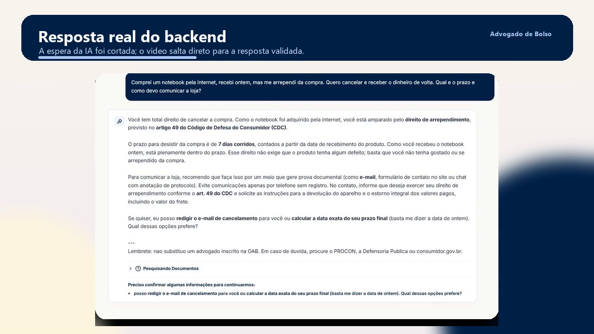
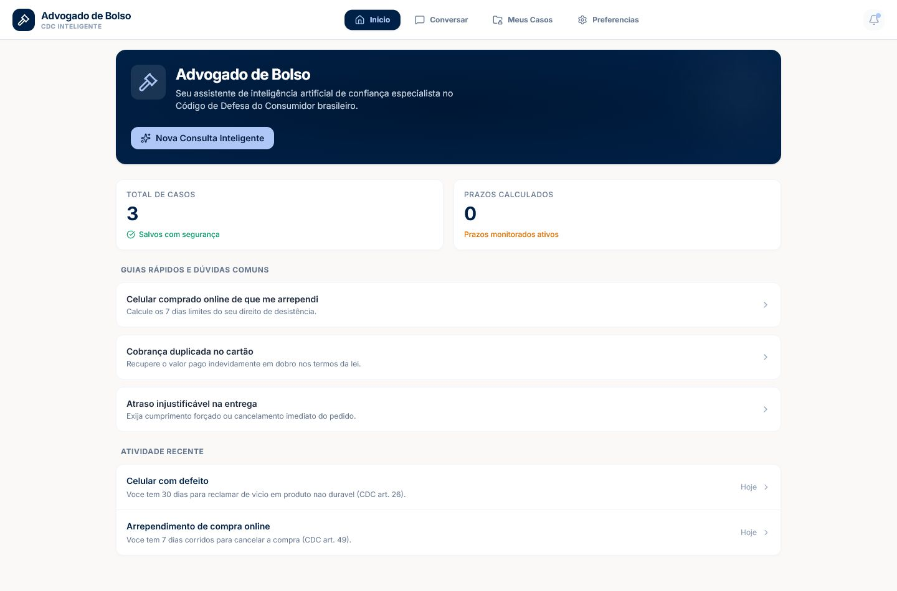
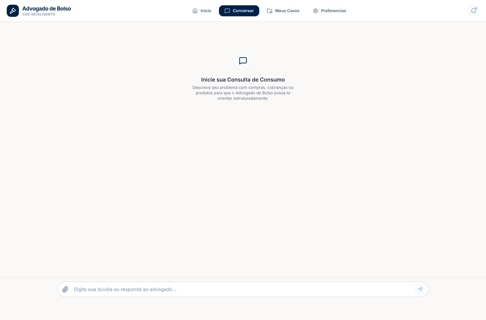
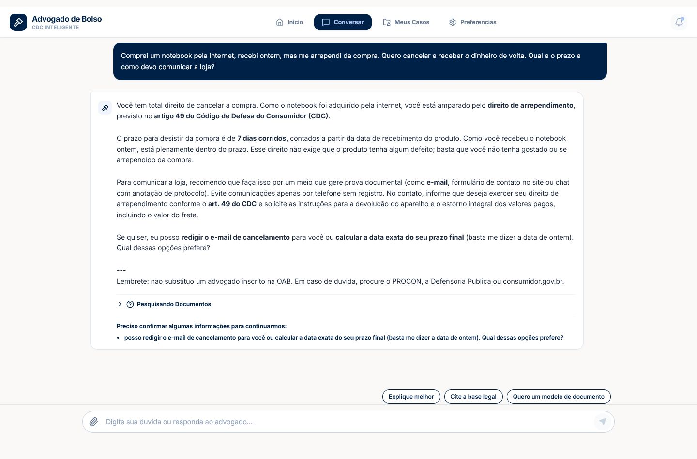
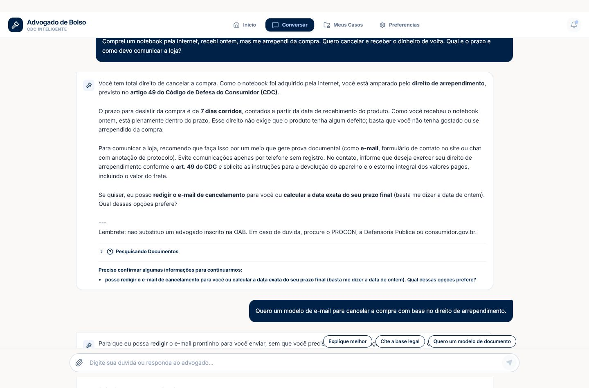
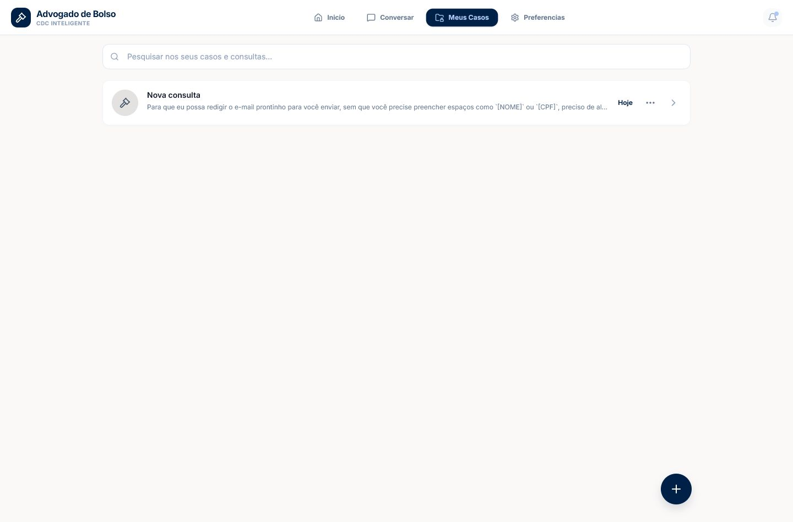
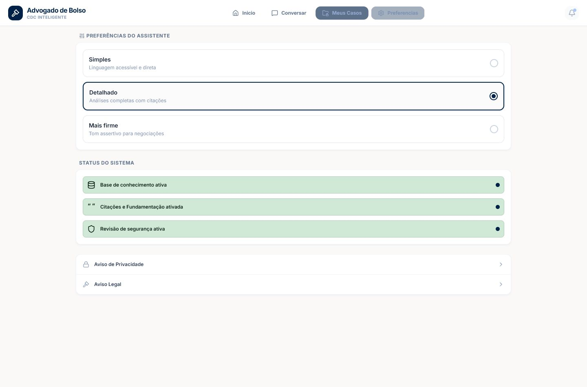

# Relatorio de demonstracao - Advogado de Bolso

Este material resume o fluxo visual principal do aplicativo para uso em
apresentacoes, relatórios e documentação do projeto.

## Video curto

O video abaixo foi produzido a partir de telas capturadas na aplicacao real,
com backend FastAPI e revisor ativo. A espera da IA foi cortada na edicao para
evitar que a demonstracao pareca lenta.

[Abrir video MP4](assets/advogado-de-bolso-demo.mp4)

## Fluxo demonstrado

1. Painel inicial com guias rapidos, casos recentes e entrada para nova
   consulta.
2. Nova consulta de consumo com pergunta em linguagem natural.
3. Resposta real do backend com orientacao baseada no CDC e sugestoes de
   continuidade.
4. Caso persistido na lista de consultas.
5. Preferencias do assistente e indicadores de seguranca.

## Capturas principais

### Painel inicial

### Nova consulta

### Resposta real do assistente

### Continuidade da conversa

### Casos salvos

### Preferencias e seguranca

